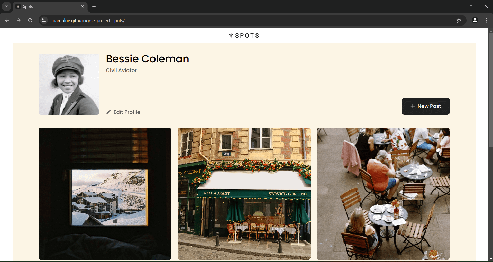
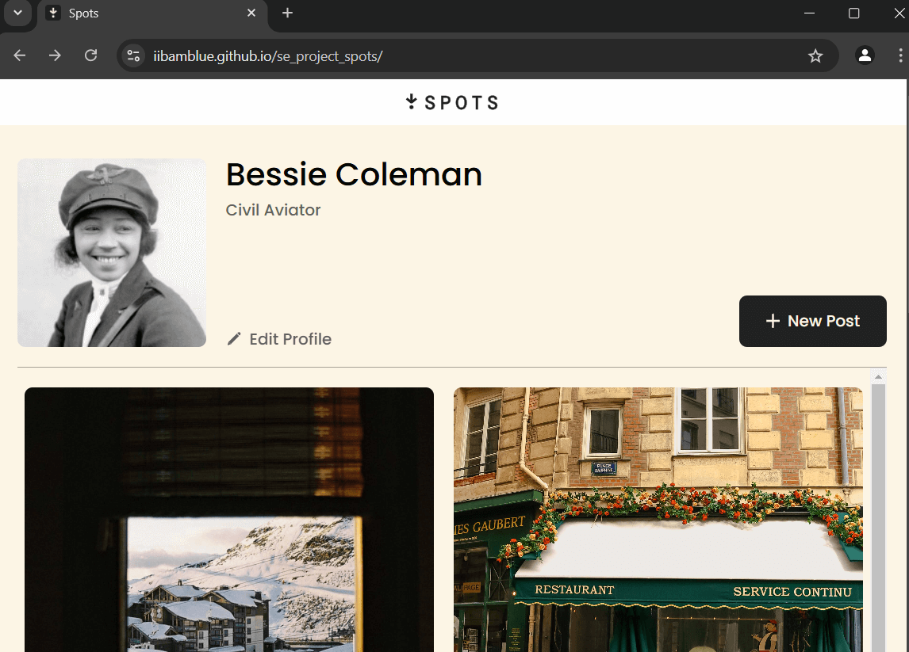
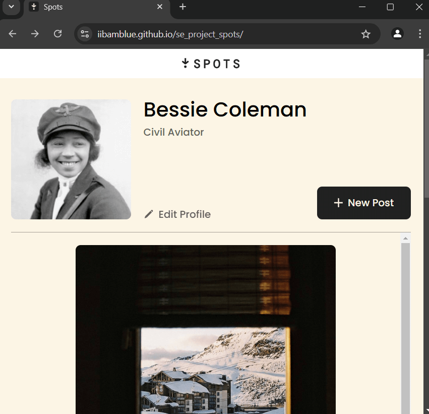
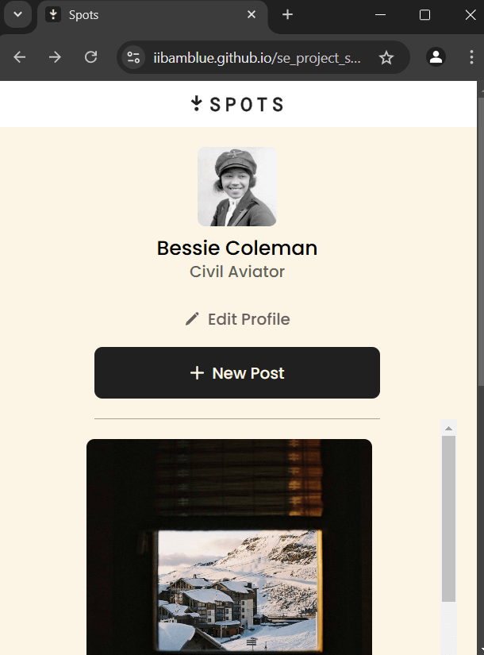

# Project 3: Spots

## Overview

- Mobile App View 320px - 626px
  Features:

  - special profile layout
  - 1 card per row

- Tablet View 627px - 1320px
  Features:

  - smaller tablets: 627px - 884px, 1 card per row
  - bigger tablets: 885px - 1320px, 2 cards per row

- Desktop View 1321px - 1440px
  Features:
  - 3 cards per row
  - content restriction @ 1440px

## Description

- Responsive design for figma app, elements are displayed correctly on popular screen sizs

## Tech Stack

- HTML
- CSS
- Responsive design for popular screen sizes 320px-2440px
- Overflow Management
- Hover effects

## Deployment

this webpage is deployed to GitHub Pages

- Depoloyment Link: https://iibamblue.github.io/se_project_spots/

## **_Sneak Peak_**

- #### Desktop View

  

- #### Big Tablet View

  

- #### Small Tablet View

  

- #### Mobile View

  

- #### Video Deployment Link: ### ***https://1drv.ms/v/s!AuLgZqmc_oRWjOMXpXFkDUQ95VXR4A***

### **_Overview from Triple Ten_**

- Intro
- Figma
- Images

**Intro**

This project is made so all the elements are displayed correctly on popular screen sizes. We recommend investing more time in completing this project, since it's more difficult than previous ones.

**Figma**

- [Link to the project on Figma](https://www.figma.com/file/BBNm2bC3lj8QQMHlnqRsga/Sprint-3-Project-%E2%80%94-Spots?type=design&node-id=2%3A60&mode=design&t=afgNFybdorZO6cQo-1)

**Images**

The way you'll do this at work is by exporting images directly from Figma — we recommend doing that to practice more. Don't forget to optimize them [here](https://tinypng.com/), so your project loads faster.

Good luck and have fun!

### **_notes to self_**

- content is cleaned and descriptions have been commented made a commit ready for submission
- header has been cleaned and added descriptionss. commit sent. ready for submission
- profile clean and descriptions added. commit sent. ready for submission
- footer cleaned up and descriptions added. commit made. ready for submission
- cards clean and descriptions added. commit sent ready for submission
- card clean and descriptions added. commit sent. ready for submission
- page cleaned and described. commit sent. ready for submission

  ~~### - need to add video~~
